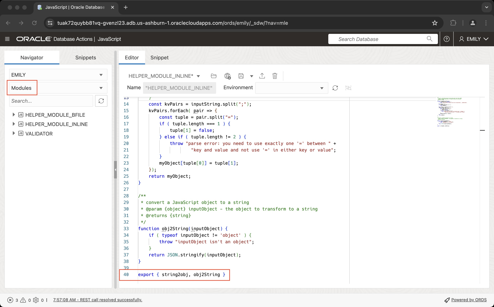
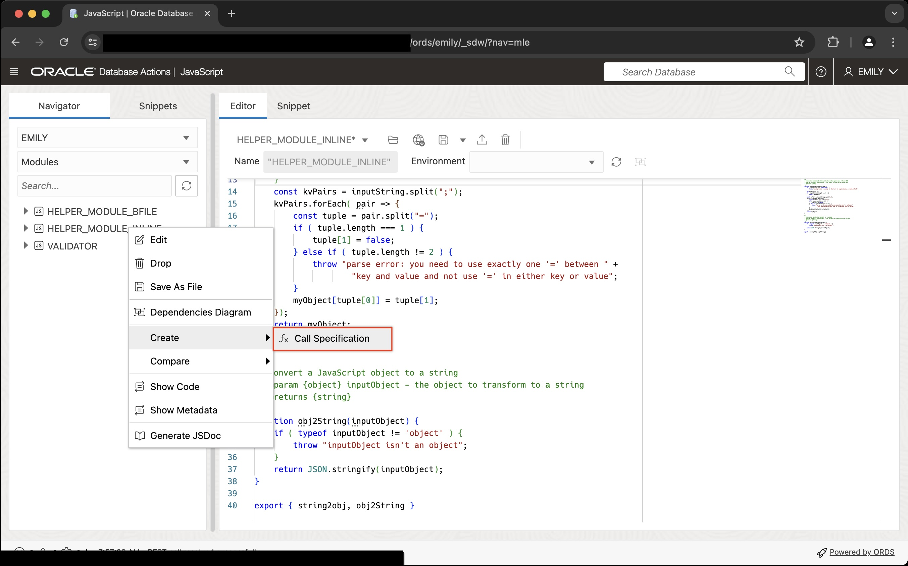
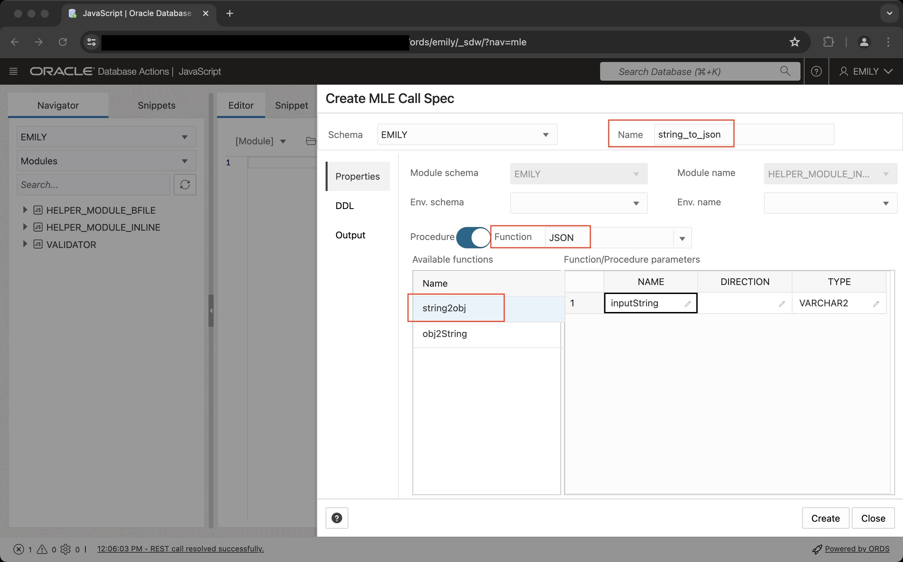

# Declare JavaScript functions

## Introduction

After creating JavaScript modules and environments in the previous lab you will now learn how to expose JavaScript code in SQL and PL/SQL. After completing this step you can call JavaScript code anywhere you can invoke SQL and PL/SQL functions. All client code, regardless whether it's written in Java, Python, or even with `node-oracledb`, can access JavaScript stored procedures.

Estimated Lab Time: 10 minutes

### Objectives

In this lab, you will:

- Learn more about call specifications
- Create call specifications for JavaScript modules
- Invoke JavaScript code in SQL and PL/SQL
- Understand inline JavaScript functions

### Prerequisites

This lab assumes you have:

- An Oracle Database 23ai Always Free Autonomous Database-Serverless environment available to use
- Created the EMILY account as per Lab 1

## Task 1: Learn more about call specifications

Call specifications are a standard extension to the PL/SQL language allowing you to provide instructions in a different programming language. The function or procedure bodies are typically expressed in PL/SQL, in this lab however you are going to create call specifications for JavaScript.

Technically speaking the call specification follows the `IS|AS` keyword in the `CREATE PROCEDURE` or `CREATE FUNCTION` statement. Call specifications come in many different variants as you can see in the PL/SQL language reference. The following railroad diagram has been copied from the `CREATE PROCEDURE` statement.


The call specification replaces the PL/SQL function or procedure's body:


> **Note**: For more information about call specifications, including context for the above syntax diagrams, see Oracle Database PL/SQL Language Reference.

You can define call specifications for multiple languages. The JavaScript syntax is defined as follows:


JavaScript developers can choose from 2 options:

- Refer to a function in a JavaScript module
- Provide the JavaScript code inline with the PL/SQL code unit

Both options will be covered in this lab.

## Task 2: Create a simple call specification referring to functions in a module

In this task you will learn how to create a call specification based on the MLE module name and (JavaScript) function.

1. Log into Database Actions using the EMILY account you created in lab 1.

    From the Database Action's landing page, switch to the JavaScript editor.

2. Review the source code for `helper_module_inline`

    Before you can invoke functions defined in a module you need to ensure they are exported. From the navigator on the left hand side, switch to Modules if not done already, and right-click on the `HELPER_MODULE_INLINE` module. Pick _Edit_ from the context menu to display the source code.

    You can see in line 48 that both functions declared in the module are exported.

    

3. Create call specification for `helper_module_inline`

    You can see from the output above that both functions in the module are exported (line 48). This allows us to create call specifications for both functions. Before you go ahead and create one you need to decide whether you need a PL/SQL function or procedure. In the above case both JavaScript functions return data:

    - `string2obj(string)` returns a JavaScript object
    - `object2String(object)` returns a string

    The PL/SQL equivalent to a JavaScript function returning anything except `void` is a function. In case a JavaScript function does not return anything (`void`), a PL/SQL procedure should be chosen.

    Whilst still using the JavaScript editor, right-click on `HELPER_MODULE_INLINE` and choose `create call specification` as shown in this screenshot:

    

    Enter the details about your call specification in the wizard using the following screenshot as your reference. Change the defaults in the highlighted input fields.

    

    Experiment with the wizard for a bit, you can double-click the function parameters (inputString) and rename them if you like. It is possible to change the type as well should it be needed (not in this example). A click on the _Create_ button closes the wizard and creates the call specification.

    Create another call specification for the second JavaScript function, `obj2String`, again based on `helper_module_inline`:

    - set the call spec name to `json_to_string`
    - from the list of available functions, choose `obj2String`
    - change the signature field to read `obj2String` by removing the `(object)`
    - leave the remaining fields as they are an hit the _Create_ button

4. Invoke the JavaScript code

    With the JavaScript code available to SQL and PL/SQL it is time to try it out. Begin by converting a JSON document to a string. You may have to switch to the SQL Worksheet for this.

    ```sql
    <copy>
    select json_to_string(
        JSON('{"a": 1, "b": 2, "c": 3, "d": false}')
    ) json_to_string;
    </copy>
    ```

    You should see the following output:

    ```
    JSON_TO_STRING
    ----------------------------------------
    {"a":1,"b":2,"c":3,"d":false}
    ```

    Now convert a string to a JavaScript object:

    ```sql
    <copy>
    select
        json_serialize (
            string_to_json(
                'order_id=1;order_date=2023-04-24T10:27:52;order_mode=mail;promotion_id=1'
            )
            pretty
        ) as string_to_json;
    </copy>
    ```

    You should see the following output:

    ```
    STRING2OBJ
    ----------------------------------------
    {
        "order_id" : "1",
        "order_date" : "2023-04-24T10:27:52",
        "order_mode" : "mail",
        "promotion_id" : "1"
    }
    ```

    This concludes this exercise.

## Task 3: Create a call specification involving an MLE environment

Creating call specifications for functions exported by the `business_logic` module requires an extra step. Remember from the previous lab that `business_logic` relies on `string2obj()` provided by `helper_module_inline`. 

Before you can create a call specification for `processOrder()` you must ensure an MLE environment exists that maps the import name `helpers` to the `helpers_module_inline` module.

1. Review the MLE environment

    Remember from the previous lab that you created the necessary MLE environment. Make sure it is still present in your schema by running the following query in the SQL Worksheet:

    ```sql
    <copy>
    select
        env_name,
        import_name,
        module_name
    from
        user_mle_env_imports
    order by
        env_name;
    </copy>
    ```

    You should see the following output:

    ```
    ENV_NAME                       IMPORT_NAME                    MODULE_NAME
    ------------------------------ ------------------------------ ------------------------------
    BUSINESS_LOGIC_ENV             helpers                        HELPER_MODULE_INLINE
    ```

2. Create the call specification

    With the MLE environment confirmed to be present in the database you can go ahead and create the call specification. Looking at `processOrder()` you can see that the function returns true if the order has been persisted in the database, false otherwise. It does not attempt to catch any exceptions either, requiring the caller to catch any.

    Unlike last time, this time you use the DDL statement to create the call specification.

    ```sql
    <copy>
    create or replace function process_order(
        p_order_data varchar2
    ) return boolean
        as mle module business_logic
        env business_logic_env
        signature 'processOrder';
    </copy>
    ```

    Note how you specify the MLE module, the MLE environment and finally the function (`processOrder`) from the JavaScript module in the call specification.

3. Invoke the JavaScript code

    Just like in task 3 you can now invoke the code thanks to the call specification you just created.

    ```sql
    <copy>
    declare
        l_success boolean := false;
        l_str     varchar2(256);
    begin
        l_str := 'order_id=1;order_date=2023-04-24T10:27:52;order_mode=theMode;customer_id=1;order_status=2;order_total=42;sales_rep_id=1;promotion_id=1';
        l_success := process_order(l_str);

        -- you should probably think of a better success/failure evaluation
        if l_success then
            dbms_output.put_line('success');
        else
            dbms_output.put_line('false');
        end if;
    end;
    </copy>
    ```

    After hitting the _Run Statement_ button you should see `success` printed in the _Script Output_ pane.

    In addition you will find a new row in the `ORDERS` table:

    ```
    select
        count(*)
    from
        orders;

      COUNT(*)
    ----------
             1
    ```

    You successfully created a MLE call specification with and without an accompanying environment, and executed both successfully.

## Task 4: Create inline JavaScript functions

In scenarios where you don't need the full flexibility of JavaScript modules and environments you can save some keystrokes by using inline JavaScript functions.

1. Hello World example using inline JavaScript code

    As the name implies an inline function allows you to add the JavaScript code as if it were the PL/SQL body. Refer back to Task 1 and review the figure titled `javascript_declaration`: the lower half of the railroad diagram relates to inline JavaScript functions. In its simplest form you can write the classic `hello world` example in a SQL Worksheet like so

    ```sql
    <copy>
    create or replace function hello(
        "who" varchar2
    ) return varchar2
    as mle language javascript 
    {{
        return `hello, ${who}`;
    }};
    </copy>
    ```

    Create the function by hitting `F5` (_Run as SQL Script_).

    > **Note** JavaScript identifiers are case sensitive and therefore must be enclosed in double-quotes in the PL/SQL layer or else they won't be recognised in the JavaScript portion of the code.

    Proceed by executing the function.

    ```sql
    <copy>
    select hello('javascript') greeting;
    </copy>
    ```

    You should see the following output on screen:

    ```
    SQL> select hello('javascript') greeting;

    GREETING
    ------------------------
    hello, javascript
    ```

2. Convert string2obj() to an inline JavaScript function

    Following the same syntax diagram let's convert `string2obj()` to an inline function

    ```sql
    <copy>
    create or replace function string_to_json_inline(
        "inputString" varchar2
    ) return JSON
    as mle language javascript
    {{
        if ( inputString === undefined ) {
            throw `must provide a string in the form of key1=value1;...;keyN=valueN`;
        }

        let myObject = {};
        if ( inputString.length === 0 ) {
            return myObject;
        }
        
        const kvPairs = inputString.split(";");
        kvPairs.forEach( pair => {
            const tuple = pair.split("=");
            if ( tuple.length === 1 ) {
                tuple[1] = false;
            } else if ( tuple.length != 2 ) {
                throw "parse error: you need to use exactly one '=' between " + 
                "key and value and not use '=' in either key or value";
            }

            myObject[tuple[0]] = tuple[1];
        });
        return myObject;
    }};
    /
    </copy>
    ```

    Create the function by hitting _Run as SQL Script_ (`F5`), and test it:

    ```sql
    <copy>
    select json_serialize(
        string_to_json_inline(
            'order_id=1;order_date=2023-04-24T10:27:52;order_mode=mail;promotion_id=1'
        )
        pretty
    ) string_to_json_inline;
    </copy>
    ```

    If you see the following output on screen everything went as expected:

    ```
    STRING_TO_JSON_INLINE
    --------------------------------------------------
    {
      "order_id" : "1",
      "order_date" : "2023-04-24T10:27:52",
      "order_mode" : "mail",
      "promotion_id" : "1"
    }
    ```

    Congratulations on creating your first inline call specifications!

## Task 5: View dictionary information about call specifications

The data dictionary has been enhanced in Oracle Database 23ai to provide information about call specifications. A new view, named `USER_MLE_PROCEDURES` provides the mapping between PL/SQL code units and JavaScript. There are of course corresponding _ALL/DBA/CDB_ views as well.

1. Query `USER_MLE_PROCEDURES` to learn more about the existing call specifications

    ```sql
    <copy>
    select
        object_name, 
        procedure_name, 
        module_name, 
        env_name 
    from
        user_mle_procedures 
    order by
        object_name;
    </copy>
    ```

2. Understand the query output

    The following is an example of the output generated by the previous query, you may have additional rows returned.

    ```
    OBJECT_NAME              PROCEDURE_NAME    MODULE_NAME             ENV_NAME               
    ________________________ _________________ _______________________ ______________________ 
    HELLO                                                                                     
    ISEMAIL                                    VALIDATOR                                      
    JSON_TO_STRING                             HELPER_MODULE_INLINE                           
    PROCESS_ORDER                              BUSINESS_LOGIC          BUSINESS_LOGIC_ENV    
    STRING_TO_JSON                             HELPER_MODULE_INLINE                           
    STRING_TO_JSON_INLINE             
    ```

    Due to the way the view is defined, you will sometimes see both `object_name` and `procedure_name` populated, while sometimes just `object_name` is populated and `procedure_name` is null.

    - When using PL/SQL packages to encapsulate JavaScript functions both columns are populated with `object_name` referring to the package name and `procedure_name` to the function/procedure _within_ the package
    - In case of stand-alone PL/SQL functions and procedures `object_name` is populated and `procedure_name` is null
    - Inline JavaScript functions and procedures don't have a corresponding `module_name`

You many now proceed to the next lab.

## Learn More

- [Database PL/SQL Language Reference](https://docs.oracle.com/en/database/oracle/oracle-database/23/lnpls/index.html)
- [JavaScript Developer's Guide](https://docs.oracle.com/en/database/oracle/oracle-database/23/mlejs/mle-js-modules-and-environments.html#GUID-32E2D1BB-37A0-4BA8-AD29-C967A8CA0CE1) describes call specifications and inline JavaScript functions in detail
- [Database Reference](https://docs.oracle.com/en/database/oracle/oracle-database/23/refrn/index.html) contains the definition of all dictionary views referred to in this lab

## Acknowledgements

- **Author** - Martin Bach, Senior Principal Product Manager, ST & Database Development
- **Contributors** -  Lucas Braun, Sarah Hirschfeld
- **Last Updated By/Date** - Martin Bach 06-JUN-2024
