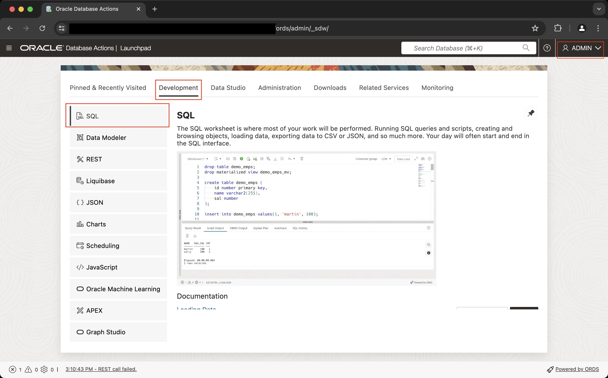
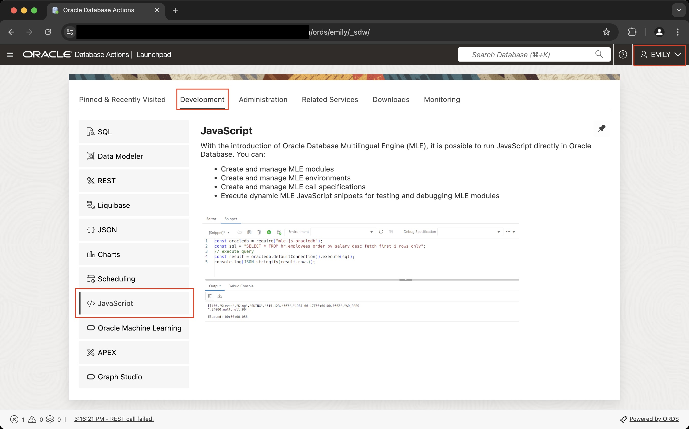
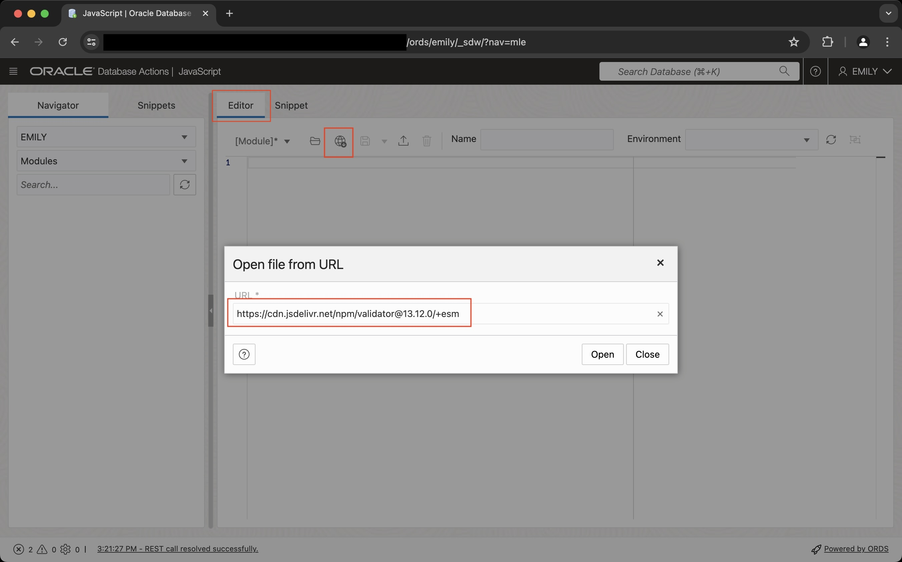
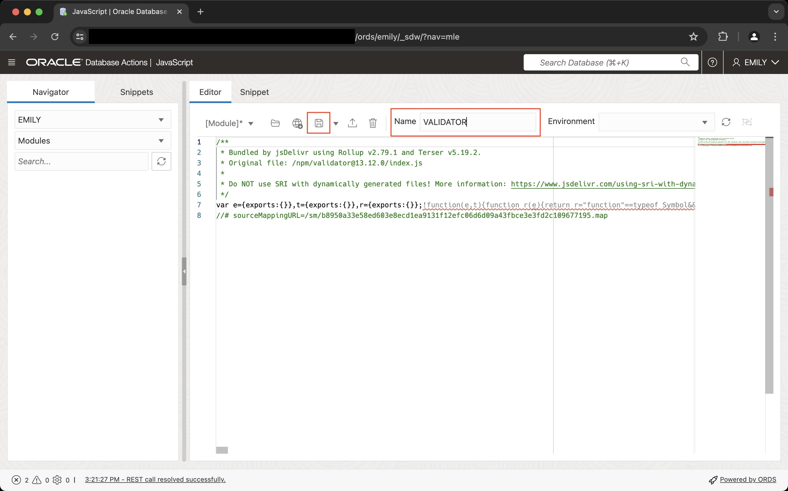
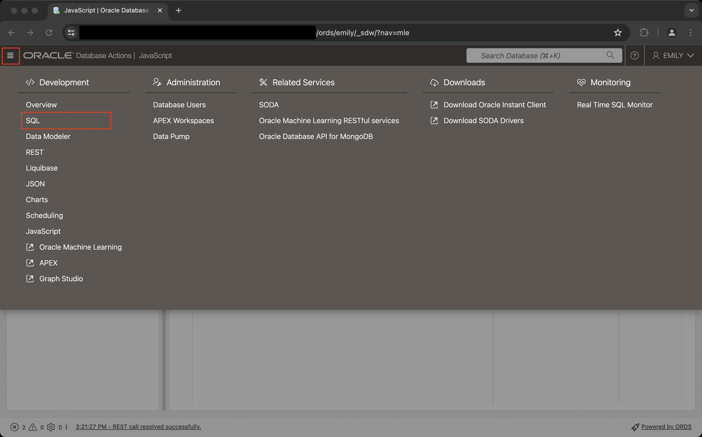
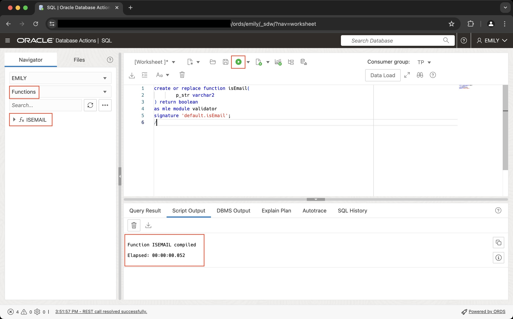

# Get started with JavaScript using a community module

## Introduction

Before jumping into the description of JavaScript features and all their details let's begin with a practical example. Enhancing data quality is a focus area for many businesses. Poor data quality prevents analysts from making properly informed decisions, and it all starts at the source system. In this lab you will read about validating email addresses, a common scenario in many applications. Validating email addresses isn't a new problem, and there are plenty of solutions available. This lab explores the open source `validator.js` module's `isEmail()` function and demonstrates how to use it in your application.

> If you intend to use `validator.js` in your own project please refer to validator's GitHub project site for more details about the project's license and implications of use.

Estimated Time: 10 minutes

### Objectives

In this lab, you will:

- Create a schema to store the JavaScript module
- Download the ECMAScript version of the `validator.js` module
- Create an MLE module in the database
- Expose the module to PL/SQL and SQL
- Validate email addresses

### Prerequisites

This lab assumes you have:

- Access to an Oracle Database 23ai Autonomous Database-Serverless instance
- Access to Database Actions and the ADMIN account

## Task 1: Create a schema to store the JavaScript module

Log in to Database Actions using the ADMIN account. Using this account you are going to create the database schema for this live lab. Once connected to Database Actions, switch to the SQL Worksheet



1. Create a new user with the necessary privileges to create, store and run JavaScript code

    In this step you prepare the creation of the developer account, `emily`. Tt will be used to store JavaScript modules in the database. Simply copy and paste the following snippet into the worksheet:

    ```sql
    <copy>
    drop user if exists emily cascade;

    create user emily identified by &secretpassword
    default tablespace users quota 10G on users
    temporary tablespace temp;

    grant db_developer_role to emily;
    grant execute on javascript to emily;
    grant execute dynamic MLE to emily;
    grant execute on dbms_cloud to emily;
    grant execute on cs_session to emily;
    grant soda_app to emily;

    create or replace directory javascript_src_dir as 'javascript_src_dir';
    grant read, write on directory javascript_src_dir to emily;
    </copy>
    ```

    Now hit `F5` or click on the _Run Script_ button to run the snippet as a script. When prompted, provide a secure password. You could have achieved the same result with the GUI, however there are still JavaScript-related grants to be added which is why it's easier to use SQL Worksheet throughout.

2. ORDS-enable the new schema

    After the account has been created successfully you need to REST-enable it or it won't be allowed to access Database Actions. Execute the following snippet:

    ```sql
    <copy>
    begin
        ords.enable_schema(
            p_enabled => true,
            p_schema => 'EMILY',
            p_url_mapping_type => 'BASE_PATH',
            p_url_mapping_pattern => 'emily'
        );
    end;
    </copy>
    ```

## Task 2: Load validator.js into the database

The `validator` module can be downloaded from multiple sources. As long as you pick a trustworthy one it doesn't really matter where the file originates from. Ensure that you get the ECMAScript (ESM) version of the module from your preferred Content Delivery Network (CDN) as they are the only ones supported in Oracle.

1. Log in as EMILY

    The use of the ADMIN user for anything except administrative work is strongly discouraged. In the previous step you created a developer account, EMILY. Sign out from the current Database Actions session. This brings you to the login screen again, where you need to log in as EMILY with the password you assigned earlier.

    Once you are logged in, pick the Development tab, and click on JavaScript on the left hand side.

    

    This brings you to the JavaScript editor.

2. Load the validator module from a content delivery network and store it in the database

    Make sure you are using the _Editor_ tab rather than _Snippets_. Next, click on the "Open from URL" icon (a little globe featuring a downward pointing arrow) to open a modal dialog. Enter the following URL:

    ```
    <copy>
    https://cdn.jsdelivr.net/npm/validator@13.12.0/+esm
    </copy>
    ```

    Clicking on the _Open_ button will load the module and store it in the database.

    

    You should see the tersed, minified version of the validator module's code in the editor window. Please enter `VALIDATOR` in the name field and hit the disk icon to save the module in the database.

    

    The navigation pane on the left hand side might need refreshing to show the new module. Click on the refresh button (double arrows in a circular fashion) next to the search field to refresh the list of modules.

    Congratulations! You just stored your first MLE module in the database.

## Task 3: Expose the module's functionality to PL/SQL and SQL

The validator module exposes quite a few string validators for any purpose imaginable, the project's GitHub page lists them all in a convenient tabular format. As per the introduction to this lab the goal is to validate email addresses. PL/SQL call specifications link a module's JavaScript functions to SQL and PL/SQL. In this simple case a stand-alone function does the trick.

1. Switch back to the SQL editor by clicking on the hamburger menu in the top left corner next to "Oracle Database Actions", you find "SQL" under "Development".

    

2. Create the call specification 

    Next, enter the following code snippet in the editor and execute the statement:

    ```sql
    <copy>
    create or replace function isEmail(
        p_str varchar2
    ) return boolean
    as mle module validator
    signature 'default.isEmail';
    </copy>
    ```

    The validator library's `index.js` (in src/index.js in the project’s Github repository) declares the validator object as the module's default export, requiring the use of the `default` keyword in the function's signature.

    

    In case where multiple JavaScript functions are made available to PL/SQL and SQL you should follow the industry's best practice and encapsulate them in a package.

## Task 4: Validate email addresses

After the JavaScript module has been created in the schema and exposed to SQL and PL/SQL it can be used like any other PL/SQL code unit. Go ahead and validate a few email addresses in SQL Worksheet:

```sql
<copy>
select isEmail('user-no-domain') as test1;
select isEmail('@domain.but.no.user') as test2;
select isEmail('user@example.com') as test3;
</copy>
```

You can see that the function works as expected:

```
SQL> select isEmail('user-no-domain') as test1;

TEST1
-----------
FALSE

SQL> select isEmail('@domain.but.no.user') as test2;

TEST2
-----------
FALSE

SQL> select isEmail('user@example.com') as test3;

TEST3
-----------
TRUE
```

You many now proceed to the next lab.

## Learn More

- [JavaScript Developer's Guide](https://docs.oracle.com/en/database/oracle/oracle-database/23/mlejs/index.html)
- [Server-Side JavaScript API Documentation](https://oracle-samples.github.io/mle-modules/)
- [Validator.js on Github](https://github.com/validatorjs/validator.js)

## Acknowledgements

- **Author** - Martin Bach, Senior Principal Product Manager, ST & Database Development
- **Contributors** -  Lucas Braun, Sarah Hirschfeld
- **Last Updated By/Date** - Martin Bach 07-JUN-2024
