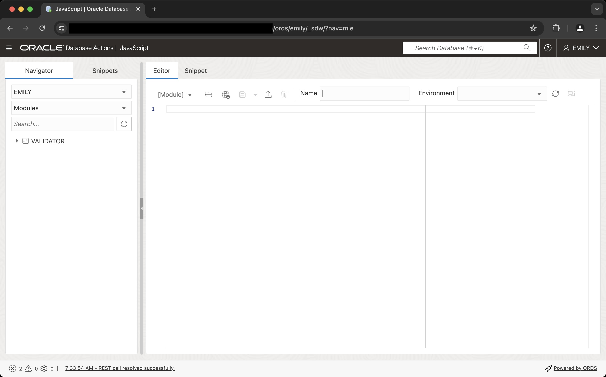
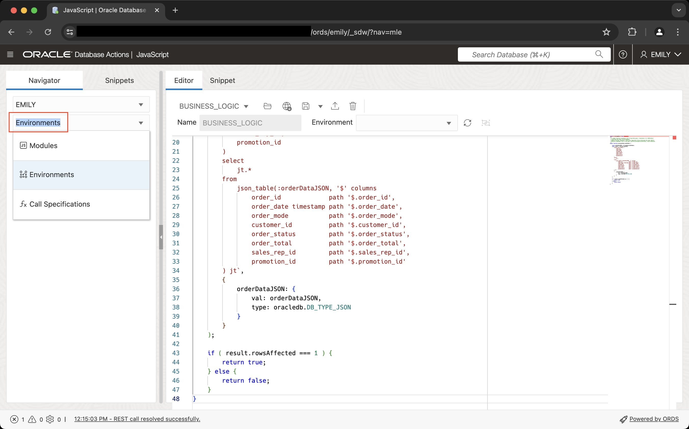
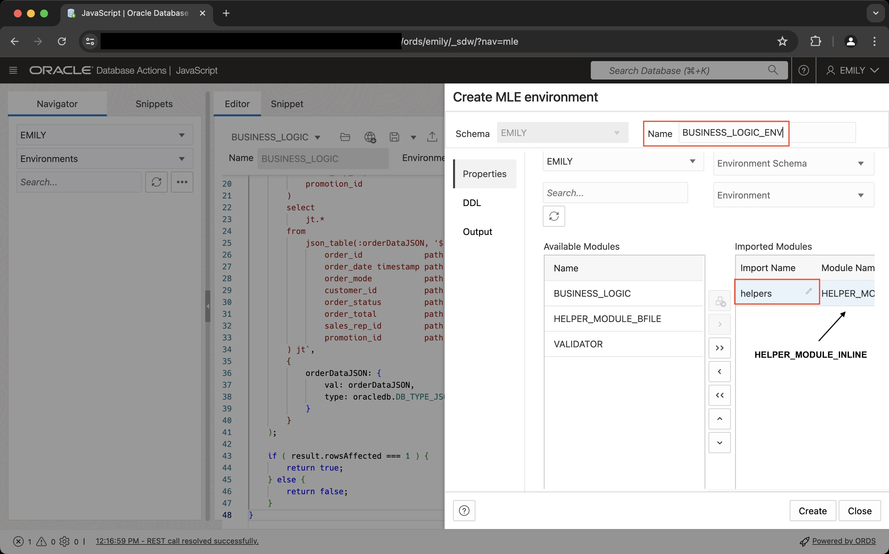

# Create JavaScript Modules and Environments

## Introduction

After the previous lab introduced JavaScript in Oracle Database 23ai you will now learn more about Multilingual Engine (MLE) modules and environments. Modules are similar in concept to PL/SQL packages as they allow you to logically group code in a single namespace. Just as with PL/SQL you can create public and private functions in a module. MLE modules contain JavaScript code expressed in terms of ECMAScript modules.

Estimated Lab Time: 10 minutes

### Objectives

In this lab, you will:

- Create JavaScript modules
- Perform naming resolution using MLE environments
- View dictionary information about modules and environments

### Prerequisites

This lab assumes you have:

- An Oracle Database 23ai Always Free Autonomous Database-Serverless environment available to use
- Created the EMILY account as per Lab 1

## Task 1: Create JavaScript modules using Database Actions

If you aren't already signed in, log into Database Actions using the EMILY account you created in lab 1.

A JavaScript module is a unit of MLE's language code stored in the database as a schema object. Storing code within the database is one of the main benefits of using JavaScript in Oracle Database 23ai compared to client-only code: rather than having to manage a fleet of application servers each with their own copy of the application, the database takes care of this for you.

In addition, Data Guard replication ensures that the exact same code is present in both production and all physical standby databases. This way configuration drift, a common problem bound to occur when invoking the disaster recovery location, can be mitigated.

> **Note**: A JavaScript module in MLE is equivalent to an ECMAScript 6 module. The terms MLE module and JavaScript module are used interchangeably in this lab.

1. Create a JavaScript module inline

    Using Database Action's JavaScript editor is the easiest way to create JavaScript modules in the database. From the hamburger menu in the top left corner select _Development_, then _JavaScript_. This brings you to the JavaScript editor.

    

    You have 2 options to work with JavaScript:

    - _Editor_: allows you to create MLE JavaScript modules in the full-featured editor
    - _Snippets_: those allow you to submit arbitrary JavaScript code against the database

    Switch to the _Editor_ if it is not yet selected and paste the following code into the editor

    ```sql
    <copy>
    /**
     * convert a delimited string into key-value pairs and return JSON
     * @param {string} inputString - the input string to be converted
     * @returns {JSON}
     */
    function string2obj(inputString) {
        if ( inputString === undefined ) {
            throw `must provide a string in the form of key1=value1;...;keyN=valueN`;
        }
        let myObject = {};
        if ( inputString.length === 0 ) {
            return myObject;
        }
        const kvPairs = inputString.split(";");
        kvPairs.forEach( pair => {
            const tuple = pair.split("=");
            if ( tuple.length === 1 ) {
                tuple[1] = false;
            } else if ( tuple.length != 2 ) {
                throw "parse error: you need to use exactly one '=' between " + 
                        "key and value and not use '=' in either key or value";
            }
            myObject[tuple[0]] = tuple[1];
        });
        return myObject;
    }

    /**
     * convert a JavaScript object to a string
     * @param {object} inputObject - the object to transform to a string
     * @returns {string}
     */
    function obj2String(inputObject) {
        if ( typeof inputObject != 'object' ) {
            throw "inputObject isn't an object";
        }
        return JSON.stringify(inputObject);
    }

    export { string2obj, obj2String }
    </copy>
    ```

    In the _Name_ field, enter `HELPER_MODULE_INLINE`, then hit the disk button to save the module in the database.

2. Create a JavaScript module from a file in the file system

    Another popular way of creating a JavaScript module is by loading it from the file system. The `BFILE` clause in the `create mle module` statement can be used to this effect. Since you are using an Autonomous Database one extra step is required: copying the JavaScript source code from object storage to the Autonomous Database. **Switch to the SQL Worksheet**, and run the following command:

    ```sql
    <copy>
    BEGIN
        DBMS_CLOUD.GET_OBJECT(
            credential_name => null,
            object_uri => ' https://objectstorage.us-ashburn-1.oraclecloud.com/p/LZ6zlbdAqPGvaJLsEmIhUzFPI6HsEl3B3IeN_1sdb281yqxyy7NdB9-1vPWm_FLC/n/c4u04/b/livelabsfiles/o/labfiles/helper_module_bfile.js',
            directory_name => 'JAVASCRIPT_SRC_DIR'
        );
    END;
    </copy>
    ```

    Check if the file has been copied successfully:

    ```sql
    <copy>
    select
        *
    from
        dbms_cloud.list_files('JAVASCRIPT_SRC_DIR')
    where
        object_name = 'helper_module_bfile.js'
    </copy>
    ```

    With the file in place you can create the module in the next step.

    ```sql
    <copy>
    CREATE OR REPLACE mle module helper_module_bfile
    LANGUAGE javascript
    USING BFILE (javascript_src_dir, 'helper_module_bfile.js');
    </copy>
    ```

    You should see `MLE module HELPER_MODULE_BFILE compiled` in the script output panel.

## Task 2: Perform name resolution using MLE environments

1. Reference existing modules

    The more modular your code, the more reusable it can be. JavaScript modules in Oracle Database 23ai can reference other modules easily, allowing developers to follow a divide and conquer approach designing applications. The code shown later in this lab makes use of the module `helper_module_inline` created earlier to convert a string representing an order before inserting it into a table.

    > **Note**: Lab 4 will explain the use of the JavaScript SQL Driver in more detail.

    Let's assume you need to create a little piece of business logic to store an order in the database. The orders table is defined as follows, please create it in your schema.

    ```sql
    <copy>
    create table orders (
        order_id     number(12) not null,
        order_date   date not null,
        order_mode   varchar2(8),
        customer_id  number(6) not null,
        order_status number(2),
        order_total  number(8,2),
        sales_rep_id number(6),
        promotion_id number(6),
        constraint pk_orders primary key(order_id)
    );
    </copy>
    ```

    The `business_logic` module will insert an order into that table after converting a comma-separated string to a JSON document which is eventually parsed by `json_table()`. Inserting data into a table requires the use of the MLE JavaScript SQL driver which will be covered in a later lab. **Switch back to the JavaScript editor** and create a new module, `BUSINESS_LOGIC` using the following code:

    ```javascript
    <copy>
    import { string2obj } from 'helpers';
    /**
     * A simple function accepting a set of key-value pairs, translates it to JSON before
     * inserting the order in the database.
     * @param {string} orderData a semi-colon separated string containing the order details 
     * @returns {boolean} true if the order could be processed successfully, false otherwise
     */
    export function processOrder(orderData) {
        
        const orderDataJSON = string2obj(orderData);
        const result = session.execute(`
            insert into orders (
                order_id,
                order_date,
                order_mode, 
                customer_id, 
                order_status,
                order_total, 
                sales_rep_id, 
                promotion_id
            )
            select
                jt.*
            from 
                json_table(:orderDataJSON, '$' columns
                    order_id             path '$.order_id',
                    order_date timestamp path '$.order_date',
                    order_mode           path '$.order_mode',
                    customer_id          path '$.customer_id', 
                    order_status         path '$.order_status',
                    order_total          path '$.order_total', 
                    sales_rep_id         path '$.sales_rep_id',
                    promotion_id         path '$.promotion_id'
            ) jt`,
            {
                orderDataJSON: {
                    val: orderDataJSON,
                    type: oracledb.DB_TYPE_JSON
                }
            }
        );

        if ( result.rowsAffected === 1 ) {
            return true;
        } else {
            return false;
        }
    }
    </copy>
    ```

2. Understand name resolution in MLE/JavaScript

    The newly created `business_logic` module introduces a new concept: an (ECMAScript) `import` statement. `string2JSON()`, defined in the helpers module is imported into the module's namespace.

    ```javascript
    import { string2obj } from 'helpers';
    /**
     * A simple function accepting a set of key-value pairs, translates it to JSON before
     *
     * more code ...
     */
    ```

    But how does MLE know what the import name `'helpers'` represents? We need to tell it first, using an MLE environment. The environment tells MLE which import name (`helpers`) maps to what module.

3. Create and edit an environment

    Let's create an environment, mapping the import name `helpers` as seen in the `business_logic` module to `helper_module_inline` in Database Actions. The left-hand side of the JavaScript editor shows a navigator. Switch from _Modules_ to _Environments_ as shown in the screenshot:

    

    The list of environments is currently empty. Create one by clicking on the `...` next to the _Search_ field, then select _Create Object_ and complete the wizard as per the screenshot:

    

## Task 3: View dictionary information about modules and environments

A number of dictionary views allow you to see which modules are present in your schema, which environments were created, and which import names have been mapped to modules. Existing views like `ALL_SOURCE` have been extended to show the module's source code. You can of course see all these details from Database Action's JavaScript editor, but it is still important to understand the dictionary changes introduced with MLE in Oracle Database 23ai. Switch back to the SQL Worksheet and run the following queries

1. View the source code of `helper_module_inline`

    ```sql
    <copy>
    select 
        line, 
        text 
    from
        user_source 
    where 
        name = 'HELPER_MODULE_INLINE';</copy>
    ```

2. View information about modules in your schema

    ```sql
    <copy>
    select
        module_name,
        language_name
    from
        user_mle_modules
    where
        language_name = 'JAVASCRIPT'
    order by
        module_name;
        </copy>
    ```

3. List all environments in your schema

    ```sql
    <copy>
    select
        env_name
    from
        user_mle_envs
    order by
        env_name;
    </copy>
    ```

4. List all environments together with their module to import name mappings

    ```sql
    <copy>
    select
        env_name,
        import_name,
        module_name
    from
        user_mle_env_imports
    order by
        env_name;
    </copy>
    ```

You many now proceed to the next lab.

## Learn More

- SQL Language Reference [CREATE MLE MODULE](https://docs.oracle.com/en/database/oracle/oracle-database/23/sqlrf/create-mle-module.html#GUID-EF8D8EBC-2313-4C6C-A76E-1A739C304DCC)
- SQL Language Reference [CREATE MLE ENV](https://docs.oracle.com/en/database/oracle/oracle-database/23/sqlrf/create-mle-env.html#GUID-419C81FD-338D-495F-85CD-135D4D316718)
- Chapter 2 in [JavaScript Developer's Guide](https://docs.oracle.com/en/database/oracle/oracle-database/23/mlejs/mle-js-modules-and-environments.html#GUID-32E2D1BB-37A0-4BA8-AD29-C967A8CA0CE1) describes modules and environments in detail
- [Database Reference](https://docs.oracle.com/en/database/oracle/oracle-database/23/refrn/index.html) contains the definition of all dictionary views
- [Mozilla Developer Network](https://developer.mozilla.org/en-US/docs/Web/JavaScript/Guide/Modules) section covering ECMAScript modules

## Acknowledgements

- **Author** - Martin Bach, Senior Principal Product Manager, ST & Database Development
- **Contributors** -  Lucas Braun, Sarah Hirschfeld
- **Last Updated By/Date** - Martin Bach 07-JUN-2024
