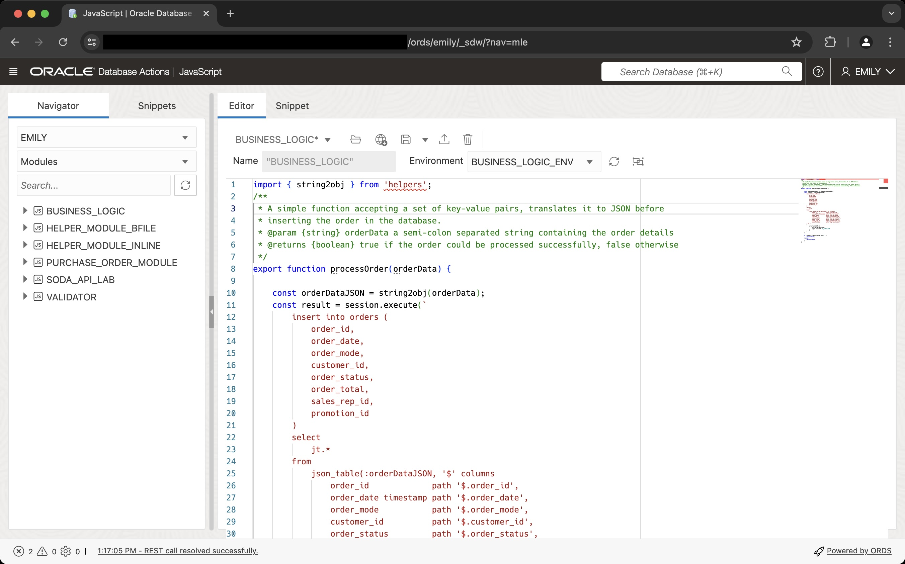
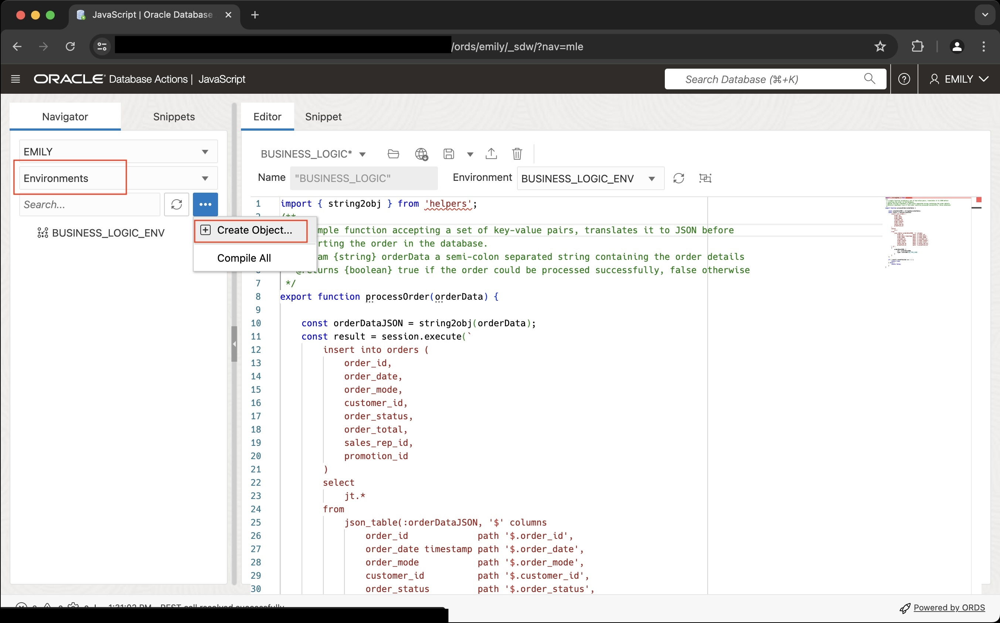
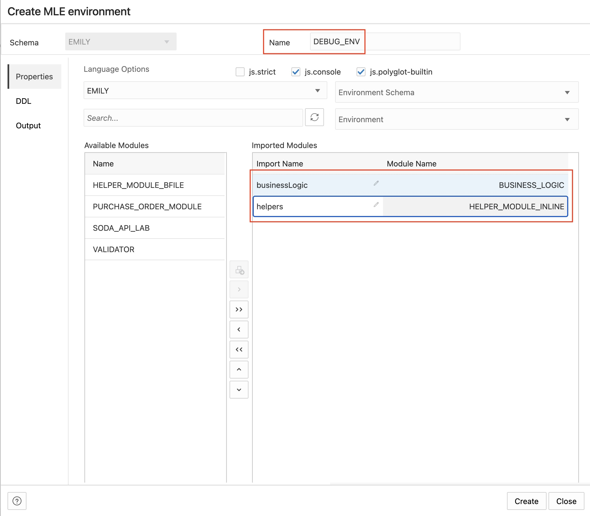
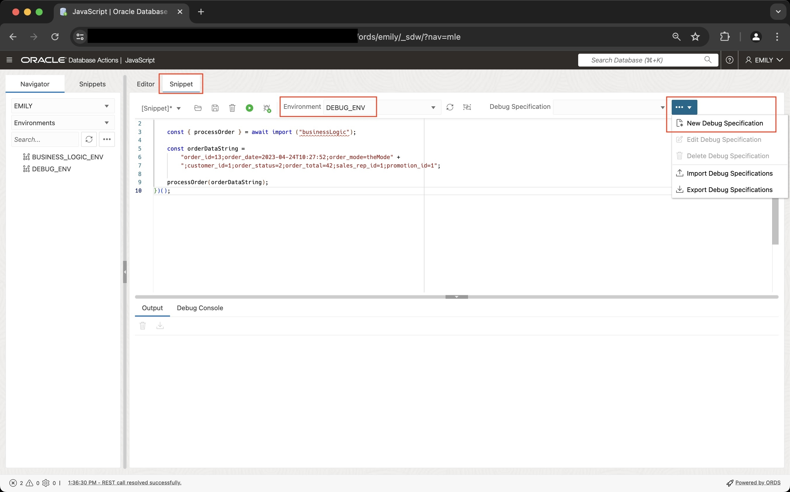
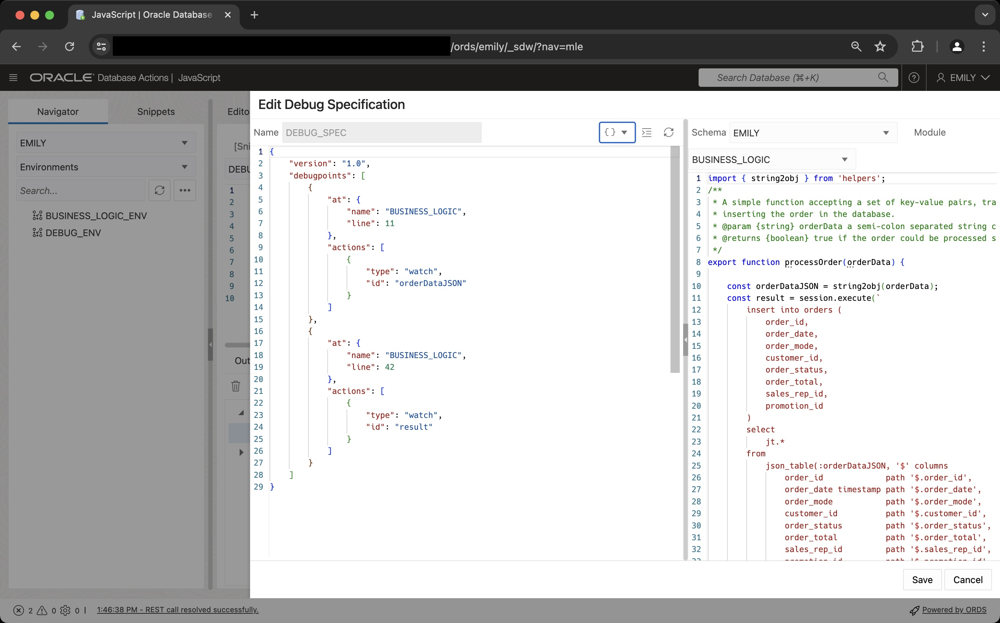
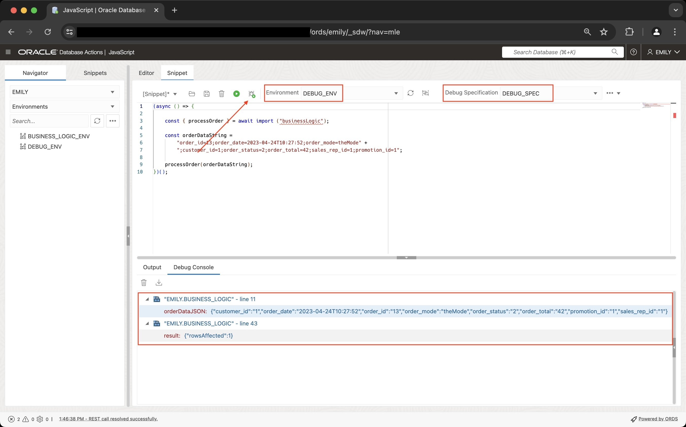

# Get insights into your code's behaviour using Post Execution Debugging

## Introduction

Oracle's JavaScript Engine allows developers to debug their code by conveniently and efficiently collecting runtime state during program execution. After the code has finished executing, the collected data can be used to analyze program behavior and discover and fix bugs. This form of debugging is known as _post-execution debugging_.

The post-execution debug option enables developers to instrument their code by specifying so-called debug points in the code. Debug points allow you to log program state conditionally or unconditionally, including values of individual variables as well as execution snapshots. Debug points are specified as JSON documents separate from the application code. No change to the application is necessary for debug points to fire.

When activated, debug information is collected according to the debug specification and can be fetched for later analysis by a wide range of tools thanks to its standard Java Profiler Heap Dump version 1.0.1 as defined in JDK6 format.

Estimated Lab Time: 15 minutes

### Objectives

In this lab, you will:

- Learn about the format of debug specifications
- Create a debug specification for a JavaScript module
- Run code with debugging enabled
- Parse the debug output
- Learn how to write code with an option to enable debugging dynamically at runtime

### Prerequisites

This lab assumes you have:

- An Oracle Database 23ai Always Free Autonomous Database-Serverless environment available to use
- Created the EMILY account as per Lab 1
- Completed Lab 2 where you created a number of JavaScript modules in the database

## Task 1: Get familiar with the debug specification format

The necessary debug specification is defined as a JSON document. It consists of

- A preamble
- An array of debugpoints

Each debugpoint in turn defines

- The location in the module's code where to fire
- Which action to take, optionally providing a condition for the probe to fire

Actions include printing the value of a single variable (`watch` point) or taking a `snapshot` of all variables in the current scope. More information about the structure of the debugscpec can be found in JavaScript Developers Guide, chapter 8.

## Task 2: Use Database Actions to perform post-execution debugging

Database Actions supports post-execution debugging with a nice, graphical user interface. Start by logging into Database Actions using the EMILY account. Once logged in, **navigate to the JavaScript** editor.

1. Review `BUSINESS_LOGIC` code

    From the list of modules on the right-hand side, right-click on `BUSINESS_LOGIC`, then select _Edit_ to the load the code into the editor

    

2. Create a new JavaScript environment

    On the left-hand side of the screen select "Environments" from the drop down list. Next, click on the "..." icon and select "Create Object" to open the "Create MLE Environment" Wizard.

    

    From the wizard's left hand side, listing all available modules, add both `BUSINESS_LOGIC` and `HELPER_MODULE_INLINE` to the list of imported modules by highlighting them, followed by a click on the `>` arrow. Complete the wizard as per the screenshot, changing the properties highlighted by the red text boxes.

    

    Click on the _Create_ button to persist the environment in the database.

3. Create a JavaScript snippet

    Next you create a JavaScript code snippet invoking `processOrder()` from the `BUSINESS_LOGIC` module. First switch from the (Module) _Editor_ to _Snippets_. Snippets require you to use dynamic imports which is why you see an asynchronous function. Copy and paste the following code into the **Snippets** editor:

    ```js
    <copy>
    (async () => {

        const { processOrder } = await import ("businessLogic");

        const orderDataString = 
            "order_id=13;order_date=2023-04-24T10:27:52;order_mode=theMode" +
            ";customer_id=1;order_status=2;order_total=42;sales_rep_id=1;promotion_id=1";

        processOrder(orderDataString);
    })();
    </copy>
    ```

    From the _Environment_ drop-down, select the newly created `DEBUG_ENV`. If you don't see it listed, refresh the list by clicking on the refresh button right next to it and try again.

4. Create a Debug Specification

    If you haven't yet selected `DEBUG_ENV` as your environment, do that now. With the environment associated you can create a new debug spec as shown in the screenshot.

    

    Clicking on the New Debug Specification button opens the wizard interface. Change the name to `DEBUB_SPEC` in the top left corner. Optionally select `BUSINESS_LOGIC` from the Module drop down to correlate the debug specification with the module's code.

    Paste the following debug specification into the left panel:

    ```json
    <copy>
    {
        "version": "1.0",
        "debugpoints": [
            {
                "at": {
                    "name": "BUSINESS_LOGIC",
                    "line": 11
                },
                "actions": [
                    {
                        "type": "watch",
                        "id": "orderDataJSON"
                    }
                ]
            },
            {
                "at": {
                    "name": "BUSINESS_LOGIC",
                    "line": 42
                },
                "actions": [
                    {
                        "type": "watch",
                        "id": "result"
                    }
                ]
            }
        ]
    }
    </copy>
    ```

    The completed debug spec wizard should look like this:

    

    Click on the _Create_ button to save the debug specification.

5. Run the code with debugging enabled

    Back in the Snippets editor make sure the previously created `DEBUG_ENV` is selected as _Environment_. Additionally, you must have `DEBUG_SPEC` selected from the _Debug Specification_ drop-down menu. You may have to hit the circle icon first in case list needs refreshing.

    Click on the "Debug Snippet" button pointed at by the red arrow in the following screenshot to run the JavaScript snippet with debugging enabled. Focus will automatically switch to the Debug Console where you can see the results of the debug run:

    - The watchpoint fired in line 11 showing the value of `orderDataJSON`
    - The second watchpoint fired as well, showing that exactly 1 row was affected by the insert statement

    

## Task 3 (optional): On-demand debugging

In an ideal world post-execution debugging should be simple to enable without having to change any code, maybe even by a "super user" application account. Otherwise, support will find it very hard to troubleshoot problems reported by the user base. Rather than hard-coding calls to `dbms_mle.enable_debugging()` and `dbms_mle.disable_debugging()`, in this task you will learn how to run business logic with debugging enabled on demand.

1. Create a table containing the debug specifications

    ```sql
    <copy>
    create table debug_metadata (
        id number generated always as identity,
        constraint pk_debug_metadata primary key(id),
        debug_spec JSON not null,
        valid boolean not null
    );
    </copy>
    ```

2. Add the debug specification created earlier to the table

    ```sql
    <copy>
    insert into debug_metadata (
        debug_spec,
        valid
    ) values (
        JSON('{
            "version": "1.0",
            "debugpoints": [
                {
                    "at": {
                        "name": "BUSINESS_LOGIC",
                        "line": 11
                    },
                    "actions": [
                        {
                            "type": "watch",
                            "id": "orderDataJSON"
                        }
                    ]
                },
                {
                    "at": {
                        "name": "BUSINESS_LOGIC",
                        "line": 42
                    },
                    "actions": [
                        {
                            "type": "snapshot"
                        }
                    ]
                }
            ]
        }'),
        true
    );

    commit;
    </copy>
    ```

3. The following table contains the result of each debug run for later analysis

    ```sql
    <copy>
    create table debug_runs (
        id number generated always as identity,
        constraint pk_debug_runs primary key(id),
        debug_spec_id number not null,
        constraint fk_spec_run foreign key (debug_spec_id) 
            references debug_metadata,
        run_start timestamp,
        run_end timestamp,
        debug_info BLOB not null
    );
    </copy>
    ```

4. Create a wrapper function for `business_logic_pkg.process_order()`

    The wrapper function adds another layer of abstraction to `process_order()` allowing the execution with and without a debug specification attached. The revised code of the `business_logic_pkg` is as follows:

    ```sql
    <copy>
    create or replace package business_logic_pkg as

        procedure process_order(
            p_order_data     varchar2,
            p_debug_spec_id  debug_metadata.id%type default null
        );

    end business_logic_pkg;
    /
    </copy>
    ```

    ```sql
    <copy>
    create or replace package body business_logic_pkg as

        -- process_order() is now a private function
        function process_order_prvt(
            p_order_data varchar2
        ) return boolean
            as mle module business_logic
            env business_logic_env
            signature 'processOrder(string)';
        
        -- (public) wrapper function to process_order()
        procedure process_order(
            p_order_data     varchar2,
            p_debug_spec_id  debug_metadata.id%type default null
        ) as
            l_debugspec      debug_metadata.debug_spec%type;
            l_debugsink      BLOB;

            l_success        boolean := false;
            l_run_start      timestamp;
            l_run_end        timestamp;
        begin
            -- check if debugging is required
            if p_debug_spec_id is null then
                -- run normally
                dbms_output.put_line('running normally, no debug spec referenced in the call');
                l_success := process_order_prvt(p_order_data);
            else
                dbms_output.put_line('running with debugging enabled');

                -- run with debugging enabled, but only if a
                -- corresponding debug spec can be fetched
                -- from the metadata table
                begin
                    select 
                        debug_spec
                    into
                        l_debugspec
                    from
                        debug_metadata
                    where
                            id = p_debug_spec_id
                        and valid;
                exception
                    when no_data_found then
                        raise_application_error(
                            -20001, 
                            'cannot enable debugging, missing debug spec: ' || p_debug_spec_id
                        );
                    when others then
                        raise;
                end;
            
                -- before any information can appended to a LOB it must be initialised first
                dbms_lob.createTemporary(l_debugsink, false, dbms_lob.session);

                -- enable debugging
                dbms_mle.enable_debugging(l_debugspec, l_debugsink);
                
                -- record the start time
                l_run_start := systimestamp;

                -- run the business logic
                l_success := process_order_prvt(p_order_data);

                -- record the end time
                l_run_end := systimestamp;

                -- persist the debug information in the table
                insert into debug_runs (
                    debug_spec_id,
                    run_start,
                    run_end,
                    debug_info
                ) values (
                    p_debug_spec_id,
                    l_run_start,
                    l_run_end,
                    l_debugsink
                );

                -- disable debugging
                dbms_mle.disable_debugging();
            end if;

            -- raise an error if the order couldn't be processed
            if not l_success then
                raise_application_error(
                    -20002,
                    'could not process the order'
                );
            end if;

            dbms_output.put_line('execution finished successfully');
        
        -- anything not caught should bubble up the error stack and dealt with
        -- by the caller of this procedure
        exception
            when others then
                raise;
        end process_order;

    end business_logic_pkg;
    /
    </copy>
    ```

5. Run the wrapper code with debugging disabled

    ```sql
    <copy>
    declare
        l_order_as_string varchar2(512);
    begin
        l_order_as_string := 'order_id=20;order_date=2023-04-24T10:27:52;order_mode=theMode;customer_id=1;order_status=2;order_total=42;sales_rep_id=1;promotion_id=1';
        business_logic_pkg.process_order(l_order_as_string, null);
    exception
        when others then
            raise;
    end;
    </copy>
    ```

    You should get the following output (some of it removed for clarity)

    ```
    running normally, no debug spec referenced in the call
    execution finished successfully

    PL/SQL procedure successfully completed.
    ```

    The order has been successfully processed.

6. Run the wrapper code with debugging enabled

    ```sql
    <copy>
    declare
        l_order_as_string varchar2(512);
    begin
        l_order_as_string := 'order_id=21;order_date=2023-04-24T10:27:52;order_mode=theMode;customer_id=1;order_status=2;order_total=42;sales_rep_id=1;promotion_id=1';
        business_logic_pkg.process_order(l_order_as_string, 1);
    exception
        when others then
            raise;
    end;
    </copy>
    ```

    You should get the following output (some of it removed for clarity)

    ```
    running with debugging enabled
    execution finished successfully

    PL/SQL procedure successfully completed.
    ```

    In addition to the information printed on screen you can find the result of the debug run in the `debug_run` table. Get run metadata as follows (assuming this was the first successful execution the run ID will be 1, adjust as needed):

    ```sql
    <copy>
    select
        json_serialize(dbms_mle.parse_debug_output(debug_info) pretty) debug_info
    from
        debug_metadata md
        join debug_runs r
        on (md.id = r.id)
    where
        r.id = (select max(id) from debug_runs);
    </copy>
    ```

    From the Query Result pane, left-click the only row returned by the query, then click on the little "eye" icon to see the output. You should see the following JSON:

    ```json
    [
        [
            {
                "at": {
                    "name": "EMILY.BUSINESS_LOGIC",
                    "line": 11
                },
                "values": {
                    "orderDataJSON": {
                        "customer_id": "1",
                        "order_date": "2023-04-24T10:27:52",
                        "order_id": "21",
                        "order_mode": "theMode",
                        "order_status": "2",
                        "order_total": "42",
                        "promotion_id": "1",
                        "sales_rep_id": "1"
                    }
                }
            }
        ],
        [
            {
                "at": {
                    "name": "EMILY.BUSINESS_LOGIC",
                    "line": 43
                },
                "values": {
                    "result": {
                        "rowsAffected": 1
                    },
                    "this": {},
                    "orderData": "order_id=21;order_date=2023-04-24T10:27:52;order_mode=theMode;customer_id=1;order_status=2;order_total=42;sales_rep_id=1;promotion_id=1",
                    "orderDataJSON": {
                        "customer_id": "1",
                        "order_date": "2023-04-24T10:27:52",
                        "order_id": "21",
                        "order_mode": "theMode",
                        "order_status": "2",
                        "order_total": "42",
                        "promotion_id": "1",
                        "sales_rep_id": "1"
                    }
                }
            }
        ]
    ]
    ```

    Rather than displaying the JSON output on screen you can import it into any tool supporting its format and analyse it offline.

You many now proceed to the next lab.

## Learn More

- Chapter 8 in [JavaScript Developer's Guide](https://docs.oracle.com/en/database/oracle/oracle-database/23/mlejs/post-execution-debugging.html#GUID-100D0D45-205A-44C7-BEF6-2A3241F41BF4) describes post-execution debugging in detail

## Acknowledgements

- **Author** - Martin Bach, Senior Principal Product Manager, ST & Database Development
- **Contributors** -  Lucas Braun, Sarah Hirschfeld
- **Last Updated By/Date** - Martin Bach 19-JUN-2024
