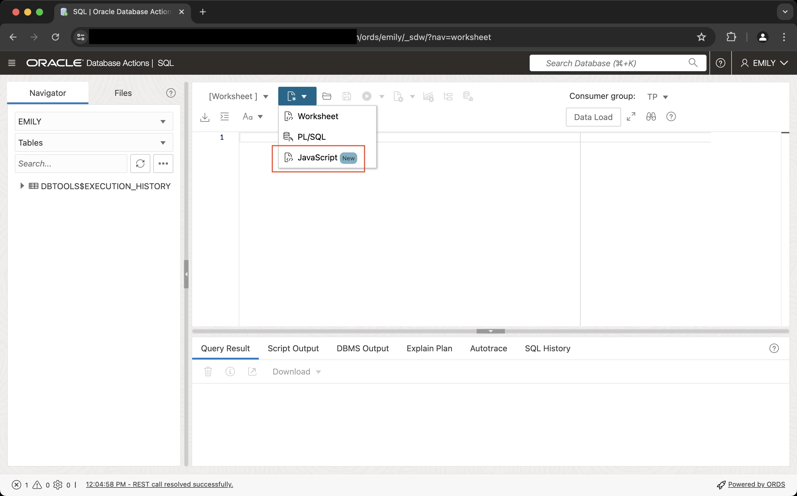

# Interact with the database using the JavaScript SQL Driver

## Introduction

All previous labs have carefully avoided accessing the data layer to ease the transition into server-side JavaScript development. Beginning with this lab you will use the SQL Driver to access the database. Whilst this lab sticks with the basic concepts, the next lab focuses on JSON from a document model's point of view.

Estimated Lab Time: 10 minutes

### Objectives

In this lab, you will:

- Learn about the built-in JavaScript SQL Driver
- Retrieve information from the database
- Perform an insert into a table fetching the auto-generated primary key in the process

### Prerequisites

This lab assumes you have:

- An Oracle Database 23ai Always Free Autonomous Database-Serverless environment available to use
- Created the EMILY account as per Lab 1

## Task 1: Get familiar with the SQL Driver

The SQL Driver is an integral part of the JavaScript Engine. It is very similar to the client-side driver, `node-oracledb` to ease the transition from client-side code to an implementation within the database. Connection management is the main difference between the two. In a client-side JavaScript environment a database connection has to be established explicitly. This is not necessary in the server-side environment because it executes in an existing database session.

The SQL API is provided in the `oracledb` object which can be obtained in two different ways:

- Either by importing `mle-js-oracledb` explicitly
- Or by using the global constant `oracledb`

Both of these will be explained in depth in this lab. Refer to the Server-Side JavaScript API Documentation for more details about the `oracledb` object.

## Task 2: Querying the database

By completing this task, you will learn more about selecting information from the database.

1. Create a database session

    Log in to Database Actions as EMILY and switch to the JavaScript editor.

2. Query the database by importing `mle-js-oracledb` explicitly in a MLE module

    Paste the following code into the _Editor_ (not _Snippets_), name it `sql_driver_lab` and hit the _Save_ button.

    ```js
    <copy>
    import oracledb from "mle-js-oracledb";

    /**
     * simple function to query the database who is working with it.
     * resembles the UNIX command `whoami`. Uses the oracledb object
     * to interact with the database.
     * @returns {string} your username
     */
    export function whoAmI() {
        // link the JavaScript SQL Driver to the existing session
        const connection = oracledb.defaultConnection();

        // execute the query, providing 
        // - the SQL text
        // - bind variables (there are none in the example)
        // - additional options to execute()
        const result = connection.execute(
            'select user'
        );

        return result.rows[0].USER;
    }
    </copy>
    ```

    > **Note**: Unlike `node-oracledb` the default `outFormat` for the MLE JavaScript SQL Driver in 23ai Free is `oracledb.OUT_FORMAT_OBJECT`.

3. Query the database using global constants

    A number of variables have been added to the global scope to enhance the developer experience. In this example you can learn how to re-write the previous module to make use of the variables in the global scope. It is generally more convenient to use the variables from the global scope as it can save you a fair bit of typing.

    For a complete list of available global variables, see JavaScript Developer’s Guide, chapter 6.

    Create a new MLE module named `sql_driver_lab_gs` with the following code:

    ```js
    <copy>
    /**
     * simple function to query the database who is working with it.
     * resembles the UNIX command `whoami`. This time variables from
     * the global scope are used, simplifying the code.
     * @returns {string} your username
     */
    export function whoAmI() {

        // there is no need to grab the defaultConnection()
        
        // execute the query, providing 
        // - the SQL text
        // - bind variables (there are none in the example)
        // - additional options to execute()
        const result = session.execute(
            'select user'
        );

        return result.rows[0].USER;
    }
    </copy>
    ```

    There are a few noteworthy differences in the code:

    - Because `oracledb` is part of the global scope there is no need to import it
    - The `session` object refers to the default connection you'd otherwise have to obtain using an extra line of code

4. Use a `ResultSet` instead of a Direct Fetch

    The previous examples demonstrated direct fetches. In other words all results are returned in the `result.rows` property. This can cause strain on the available memory if the result set is large. A more efficient way to fetch larger result sets is available in the form of the `ResultSet`.

    Create a sample table with some data first, **using SQL Worksheet**.

    ```sql
    <copy>
    create table result_set_demo_t as 
    select 
        * 
    from
        all_objects;
    </copy>
    ```

    Remaning in the SQL Worksheet, switch to JavaScript from the top down menu on the top left of the worksheet. 

    

    You can use this to execute JavaScript code without haveing to switch to the JavaScript _Snippets_ editor.

    ```js
    <copy>
    (async () => {
        const result = session.execute(
            `select
                owner,
                object_name,
                object_id
            from
                result_set_demo_t
            fetch first 10 rows only`,
            [],
            {
                resultSet: true,
                outFormat: oracledb.OUT_FORMAT_OBJECT
            }
        );

        const rs = result.resultSet;

        // use the iterable protocol with the resultSet
        for (let row of rs) {
            console.log(`${row.OBJECT_ID}    ${row.OWNER}    ${row.OBJECT_NAME}`);
        }

        // always close the ResultSet
        rs.close();
    })();
    </copy>
    ```

    When executing the code you will see the first 10 lines of the table printed to your screen.

5. Using Bind Variables

    So far none of the examples in this lab have made use of bind variables. Bind variables must be passed as the second argument to the `execute()` function and they can be provided as an array or an object. This tasks makes use of the simplified syntax offered by an array. Note that the order of the variables inside the array representing bind values must be aligned with the placeholders from the query text.

    ```js
    <copy>
    create or replace procedure result_set_demo_binds(
        "p_object_id" number
    )
    as mle language javascript
    {{
    const result = session.execute(
        `select
            owner,
            object_name,
            object_id
        from
            result_set_demo_t
        where
            object_id = :p_object_id`,
        [
            p_object_id
        ],
        {
            resultSet: true,
            outFormat: oracledb.OUT_FORMAT_OBJECT
        }
    );

    const rs = result.resultSet;
    let numRows = 0;

    // use the iterable protocol with the resultSet
    for (let row of rs) {
        console.log(`${row.OBJECT_ID}    ${row.OWNER}    ${row.OBJECT_NAME}`);
        numRows++
    }

    rs.close();

    if ( numRows === 0 ) {
        throw `no data found for object ID ${p_object_id}`;
    }
    }};
    /
    </copy>
    ```

    The newly created procedure `result_set_demo_binds` accepts integer values as input. Go ahead and try a few times to see if you can get output on your screen matching an `object_id` in the table.

## Task 3: Calling PL/SQL from JavaScript

The previous lab showed you how to query the database using SQL. In addition to using plain SQL you can make use of the rich PL/SQL API provided by the database. In this example you will use the `DBMS_APPLICATION_INFO` package to instrument your code.

`DBMS_APPLICATION_INFO` is an important PL/SQL package allowing database developers to associate an application module and action with a session. Should your application ever encounter a performance degradation your operations team can perform a detailed analysis based on the information available in the Automatic Workload Repository (AWR) and Active Session History (ASH) provided the DIAGNOSTICS pack is licensed.

This task showcases several additional features:

- IN and OUT (bind-) Variables
- Global variables in an MLE module
- Private functions (`saveModuleAction()` and `setModuleAction()`)
- Custom exception handling

1. Create the JavaScript module

    If you aren't yet using the JavaScript editor, switch to it and paste the following code and name the module `plsql_demo`:

    ```js
    <copy>
    // global variable used to preserve the existing module and action
    let savedModuleAction = {};

    // private function - preserve the current values for module and action
    function saveModuleAction() {

        // read the current module and action. Out-variables can be used
        // to retrieve the actual values and store them in the global
        // variable `savedModuleAction`.
        const result = session.execute(`
            begin dbms_application_info.read_module(
                :l_prev_module, 
                :l_prev_action); 
            end;`,
            {
                l_prev_module: {
                    dir: oracledb.BIND_OUT,
                    type: oracledb.STRING
                },
                l_prev_action: {
                    dir: oracledb.BIND_OUT,
                    type: oracledb.STRING
                }
            }
        );

        savedModuleAction.module = result.outBinds.l_prev_module;
        savedModuleAction.action = result.outBinds.l_prev_action;

        console.log(
            `saveModuleAction(): module and action successfully retrieved as:
            - module: ${savedModuleAction.module}
            - action: ${savedModuleAction.action}`
        );
    }

    // private function - restore the previous module and action
    function setModuleAction(module, action) {

        // this call changes the current module and action to the
        // values provided to the function
        session.execute(`
            begin dbms_application_info.set_module(
                module_name => :module,
                action_name => :action);
            end;`,
            [ module, action ]
        );

        console.log(
            `setModuleAction(): module and action successfully updated to:
            - module: ${module}
            - action: ${action}`
        );
    }

    // public function - entry point to the demo
    // to keep the example simple the changes in module
    // and action are printed to the console
    export function moduleActionDemo(object_id) {

        // save the current module and action
        saveModuleAction();

        // set module and action for this task
        setModuleAction('JavaScript PLSQL demo', object_id);

        // execute the "application code"
        const result = session.execute(
            `select
                owner,
                object_name,
                object_id
            from
                result_set_demo_t
            where
                object_id = :object_id`,
            [
                object_id
            ],
            {
                resultSet: true,
                outFormat: oracledb.OUT_FORMAT_OBJECT
            }
        );

        const rs = result.resultSet;
        let numRows = 0;

        for (let row of rs) {
            console.log(`Found a matching record: ${row.OBJECT_ID}    ${row.OWNER}    ${row.OBJECT_NAME}`);
            numRows++
        }

        rs.close();

        // check if any data was returned, throw an exception otherwise
        if ( numRows === 0 ) {
            // make sure module and action are set to their previous values
            // before throwing the exception
            setModuleAction(savedModuleAction.module, saveModuleAction.action);
            throw `no data found for object ID ${p_object_id}`;
        }

        // make sure module and action are set to their previous values
        // before returning from this function
        setModuleAction(savedModuleAction.module, saveModuleAction.action);
    }
    </copy>
    ```

2. Create a call specification for `moduleActionDemo()`

    Create a MLE call specification by right-clicking `plsql_demo` module in the navigation pane on the left hand side followed by _Create Call Spec_. In the ensuing dialog, ensure to complete the fields as follows:

    - Name: moduleActionDemo
    - From the list of available functions, select `moduleActionDemo`. The panel on the right hand side is now populated with the function's argument and type
    - Ensure the type is set to `number` rather than `varchar2` by double-clicking the little pencil icon next to `VARCHAR2` and selecting `NUMBER` from the drop down
    - Leave everything as is and click on _Create_ to create the call specification

    Alternatively, switch to the SQL Worksheet and create the call specification using the following anonymous PL/SQL block:

    ```sql
    <copy>
    create or replace procedure moduleActionDemo(p_object_id number)
    as mle module plsql_demo
    signature 'moduleActionDemo(number)';
    /
    </copy>
    ```

3. Execute the JavaScript function

    Switch to SQL Worksheet, then run the following code:

    ```sql
    <copy>
    set serveroutput on
    declare
        l_object_id RESULT_SET_DEMO_T.object_id%type;
    begin
        select 
            min(object_id)
        into
            l_object_id
        from
            RESULT_SET_DEMO_T;
        
        moduleActionDemo(l_object_id);
    end;
    /
    </copy>
    ```

    The command should complete successfully, but results will vary because object IDs aren't guaranteed to be assigned in the same way for each database. Here is an example of a successful execution:

    ```
    SQL> declare
      2     l_object_id RESULT_SET_DEMO_T.object_id%type;
      3  begin
      4     select
      5         min(object_id)
      6     into
      7         l_object_id
      8     from
      9         RESULT_SET_DEMO_T;
      10
      11     moduleActionDemo(l_object_id);
      12 end;
      13 /
    saveModuleAction(): module and action successfully retrieved as:
    - module: SQL*Plus
    - action: null
    setModuleAction(): module and action successfully updated to:
    - module: JavaScript PLSQL demo
    - action: 138
    Found a matching record: 138    SYS    ORA$BASE
    setModuleAction(): module and action successfully updated to:
    - module: SQL*Plus
    - action: undefined

    PL/SQL procedure successfully completed.
    ```

## Task 4: Perform a DML operation

The previous tasks in this lab focused on _reading_ from the database. In this part of the lab you will perform an insert operation for a change. Rather than providing all columns as part of the insert, you will use a primary key that is defined as an Identity Column. While you are still in SQL Worksheet, create a new table by copying/pasting and executing the following create table statement into the editor window.

1. Create a new table for this example

    ```sql
    <copy>
    create table log_t (
        log_id number generated always as identity,
        constraint pk_log_t primary key (log_id),
        log_message varchar2(1024),
        log_time timestamp default systimestamp not null
    );
    </copy>
    ```

2. Create an inline JavaScript function to facilitate the insert statement

    Stay in SQL Worksheet, and create the following function. Note the use of an object to provide bind variables (both IN and OUT) to the statement, rather than the previously used array. The out-variable will fetch the auto-generated value for the primary key and return it to the caller.

    ```js
    <copy>
    create or replace function log_me(
        "p_log_message" log_t.log_message%type
    ) return log_t.log_id%type 
    as mle language javascript
    {{
    const result = session.execute(
        `insert into log_t (
            log_message
        ) values (
            :message
        )
        returning log_id into :id`,
        {
            message: {
                dir: oracledb.BIND_IN,
                val: p_log_message,
                type: oracledb.STRING
            },
            id: {
                dir: oracledb.BIND_OUT,
                type: oracledb.NUMBER
            }
        },
    );

    // by definition the outBinds array can contain only a single
    // element in this scenario. If there are potentially more rows
    // you need to act accordingly
    return result.outBinds.id[0];
    }};
    </copy>
    ```

3. Generate and display an example log message

    Execute the following snippet in your SQL Worksheet:

    ```sql
    <copy>
    declare
        l_id number;
    begin
        l_id := log_me('this is a first test');
        dbms_output.put_line('entry created with ID: ' || l_id);
    end;
    </copy>
    ```

    The script output should provide you with the value of the auto-generated ID.

4. View the log message

    With the auto-generated value of the ID column available, query the log table:

    ```sql
    <copy>
    select
        *
    from
        log_t
    where
        log_id = &id;
    </copy>
    ```

You many now proceed to the next lab.

## Learn More

- [Server-Side JavaScript API Documentation](https://oracle-samples.github.io/mle-modules/)
- [node-oracledb Documentation](https://oracle.github.io/node-oracledb/)
- Chapter 6 in [JavaScript Developer's Guide](https://docs.oracle.com/en/database/oracle/oracle-database/23/mlejs/calling-plsql-and-sql-from-mle-js-code.html#GUID-69CF9858-66D7-45B6-ACAF-F08B059CF4F6) is dedicated to interacting with the database
- [`DBMS_APPLICATION_INFO` reference](https://docs.oracle.com/en/database/oracle/oracle-database/23/arpls/DBMS_APPLICATION_INFO.html#GUID-14484F86-44F2-4B34-B34E-0C873D323EAD)

## Acknowledgements

- **Author** - Martin Bach, Senior Principal Product Manager, ST & Database Development
- **Contributors** -  Lucas Braun, Sarah Hirschfeld
- **Last Updated By/Date** - Martin Bach 06-JUN-2024
